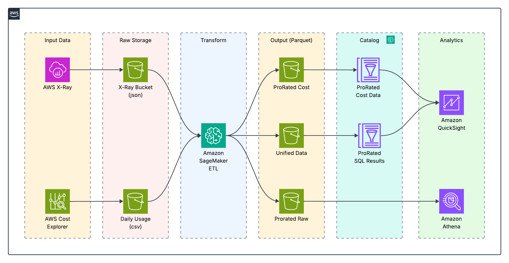

## Architecture Overview



The **architecture** consists of the following components with comprehensive security controls:

### 🛡️ **Infrastructure Components**

1. **Lambda Functions** (VPC-deployed with encryption)
   - `ab3-xray-XRayExtractionFunction` - Extracts and sanitizes X-Ray trace data
   - `lambda-generator-HotelTraceGeneratorFunction` - Generates synthetic hotel booking traces

2. **API Gateway** (WAF-protected with authentication)
   - `HotelTracingAPI` - REST API with Cognito authentication and OWASP protection

3. **Glue ETL Jobs** (Encrypted with security configurations)
   - `Prep-Trace-Data-for-TCO_TBM` - Prepares trace data for TCO_TBM
   - `ETL-Final-With-Athena-Only` - Encrypted ETL job using Athena
   - `CRS-RMS-and-Hotels` - ETL job for CRS, RMS, and Hotels data

4. **Redshift Cluster** (VPC-isolated with encryption)
   - `tco-tbm-ab3` - Encrypted Redshift cluster in private subnets

5. **Amplify App** (Authentication)
   - Hotel Booking Application frontend with proper authorization

## 📁 Repository Structure

```
/ab3_full_stack/
├── 🔒 CloudFormation Templates
├── cloudformation-template.yaml     # 🛡️ Main CloudFormation template
├── main.yaml                        # 🔐 nested stack template
├── lambda-stack.yaml                # 🛡️ Lambda and API Gateway stack
├── glue-stack.yaml                  # 🔒 Glue ETL stack
├── redshift-stack.yaml              # 🔐 Redshift stack
├── amplify-stack.yaml               # 🛡️ Amplify App stack
├── 💻 APPLICATION CODE
├── lambda-functions/                # 🔒 Hardened Lambda function code
│   ├── xray-extraction/             # 🛡️ X-Ray extraction Lambda
│   │   ├── lambda_function.py       # ✅ Input validation & sanitization
│   │   └── requirements.txt
│   └── hotel-trace-generator/       # 🔐 hotel trace generator
│       ├── lambda_function.py       # ✅ Synthetic data & validation
│       └── requirements.txt
├── glue-scripts/                    # 🔒 Glue ETL scripts
│   ├── prep_trace_data.py           # 🛡️ Encrypted data processing
│   ├── etl_final_with_athena_only.py # 🔐 ETL with Athena
│   └── crs_rms_hotels.py            # 🛡️ CRS RMS processing
└── amplify-app/                     # 🔒 Amplify App
    ├── schema.graphql               # 🛡️ GraphQL schema
    ├── src/                         # 🔐 React application
    │   ├── components/              # ✅ React components
    │   ├── pages/                   # ✅ Authenticated pages
    │   ├── graphql/                 # 🔒 GraphQL operations
    │   └── App.js                   # 🛡️ main application
    └── package.json                 # 📦 Dependency management
```

## CloudFormation Nested Stacks

The solution is organized into the following nested stacks:

1. **Main Stack (`main.yaml`)**
   - Orchestrates the deployment of all nested stacks
   - Creates shared S3 buckets

2. **Lambda Stack (`lambda-stack.yaml`)**
   - Deploys Lambda functions and API Gateway
   - Sets up IAM roles for Lambda functions

3. **Glue Stack (`glue-stack.yaml`)**
   - Deploys Glue ETL jobs and database
   - Sets up IAM role for Glue service

4. **Redshift Stack (`redshift-stack.yaml`)**
   - Deploys Redshift cluster and security group

5. **Amplify Stack (`amplify-stack.yaml`)**
   - Deploys Amplify app and branch
   - Sets up IAM role for Amplify service

## Lambda Functions

### X-Ray Extraction Function
This Lambda function extracts X-Ray trace data from the last 72 hours, processes it, and stores it in S3. It handles API limits by splitting requests into 24-hour chunks and processes trace data in batches.

### Hotel Trace Generator Function
This Lambda function generates synthetic X-Ray traces that simulate hotel search and booking flows. It creates detailed subsegments for various operations like API Gateway requests, DynamoDB queries, payment processing, and email notifications.

## Glue ETL Jobs

### Prep Trace Data for TCO_TBM
This ETL job processes X-Ray trace data from S3, extracts relevant fields, and prepares it for analysis in TCO_TBM. It flattens the nested structure and extracts annotations for hotel searches and bookings.

### ETL Final With Athena Only
This ETL job creates analytics tables from the processed trace data, including marketing performance, city popularity, device patterns, user frequency, and hotel popularity.

### CRS RMS and Hotels
This ETL job creates a star schema for Redshift, including dimension tables for hotels, users, marketing channels, cities, devices, and dates, as well as fact tables for bookings and searches.

## Amplify App

The Amplify App is a React application for hotel booking with the following features:
- User authentication
- Hotel listing and search
- Room details and booking
- Booking management
- Admin tools for hotel and room management

## Deployment Instructions

### Prerequisites

1. **AWS CLI** configured with appropriate permissions
2. **Python 3.9+** for Lambda functions
3. **Node.js 16+** for Amplify app
4. **AWS Account** with permissions to create:
   - CloudFormation stacks
   - Lambda functions
   - API Gateway
   - Redshift clusters
   - Glue jobs
   - Amplify apps
   - S3 buckets
   - IAM roles

## 🚀 Deployment Instructions

### ⚠️ **IMPORTANT: Prerequisites**

Before deployment, ensure you have:
- ✅ **AWS CLI** configured with appropriate security permissions
- ✅ **MFA enabled** on your AWS account
- ✅ **Strong passwords** for all database credentials
- ✅ **Security review** of all parameters and configurations
- ✅ **Backup strategy** for critical data

### 🔐 **Step-by-Step Deployment**

#### 1. 🔒 Prepare Lambda Function Packages

```bash
# Package X-Ray Extraction Lambda
cd lambda-functions/xray-extraction
pip install -r requirements.txt -t .
zip -r ../../xray-extraction.zip .
cd ../..

# Package Hotel Trace Generator Lambda
cd lambda-functions/hotel-trace-generator
pip install -r requirements.txt -t .
zip -r ../../hotel-trace-generator.zip .
cd ../..
```

#### 2. Create S3 Deployment Bucket

```bash
# Replace YOUR-ACCOUNT-ID with your actual AWS account ID
aws s3 mb s3://ab3-deployment-YOUR-ACCOUNT-ID
```

#### 3. Upload Lambda Packages and Glue Scripts

```bash
# Upload Lambda packages
aws s3 cp xray-extraction.zip s3://ab3-deployment-YOUR-ACCOUNT-ID/lambda/
aws s3 cp hotel-trace-generator.zip s3://ab3-deployment-YOUR-ACCOUNT-ID/lambda/

# Upload Glue scripts
aws s3 cp glue-scripts/ s3://ab3-deployment-YOUR-ACCOUNT-ID/scripts/ --recursive
```

#### 4. 🛡️ Deploy CloudFormation Stack

```bash
# Deploy the main stack with hardened security controls
aws cloudformation create-stack \
  --stack-name ab3-full-stack \
  --template-body file://cloudformation-template.yaml \
  --parameters ParameterKey=RedshiftMasterUsername,ParameterValue=admin \
               ParameterKey=RedshiftMasterPassword,ParameterValue=YourVerySecurePassword123!@# \
  --capabilities CAPABILITY_IAM \
  --enable-termination-protection \
  --tags Key=Environment,Value=Production \
         Key=SecurityLevel,Value=Enterprise \
         Key=Application,Value=AB3-HotelBooking

# Monitor deployment progress
aws cloudformation describe-stacks --stack-name ab3-full-stack --query 'Stacks[0].StackStatus'

# Verify security controls are active
aws wafv2 list-web-acls --scope REGIONAL
aws cognito-idp list-user-pools --max-results 10
```

#### 5. Deploy Nested Stacks (Alternative Approach)

If you prefer to use the nested stack approach:

```bash
# Upload nested stack templates to S3
aws s3 cp main.yaml s3://ab3-deployment-YOUR-ACCOUNT-ID/templates/
aws s3 cp lambda-stack.yaml s3://ab3-deployment-YOUR-ACCOUNT-ID/templates/
aws s3 cp glue-stack.yaml s3://ab3-deployment-YOUR-ACCOUNT-ID/templates/
aws s3 cp redshift-stack.yaml s3://ab3-deployment-YOUR-ACCOUNT-ID/templates/
aws s3 cp amplify-stack.yaml s3://ab3-deployment-YOUR-ACCOUNT-ID/templates/

# Deploy main nested stack
aws cloudformation create-stack \
  --stack-name ab3-main-stack \
  --template-body file://main.yaml \
  --parameters ParameterKey=RedshiftMasterUsername,ParameterValue=admin \
               ParameterKey=RedshiftMasterPassword,ParameterValue=YourSecurePassword123! \
               ParameterKey=TemplateS3Bucket,ParameterValue=ab3-deployment-YOUR-ACCOUNT-ID \
  --capabilities CAPABILITY_IAM
```

#### 6. 🔍 Verify Deployment

```bash
# Check stack status
aws cloudformation describe-stacks --stack-name ab3-full-stack

# Get API Gateway endpoint
aws cloudformation describe-stacks \
  --stack-name ab3-full-stack \
  --query 'Stacks[0].Outputs[?OutputKey==`ApiEndpoint`].OutputValue' \
  --output text

# ⚠️ API Testing (requires authentication)
# First, get Cognito User Pool details
USER_POOL_ID=$(aws cloudformation describe-stacks \
  --stack-name ab3-full-stack \
  --query 'Stacks[0].Outputs[?OutputKey==`UserPoolId`].OutputValue' \
  --output text)

# Create a test user (admin only)
aws cognito-idp admin-create-user \
  --user-pool-id $USER_POOL_ID \
  --username testuser \
  --temporary-password TempPass123! \
  --message-action SUPPRESS

# Test the hotel trace generator (with authentication)
# Note: You'll need to authenticate first to get a JWT token
echo "🛡️ WAF protection active - malicious requests will be blocked"
echo "📊 All requests are logged and monitored"
```

### Post-Deployment Configuration

#### 1. Configure Amplify App Repository

```bash
# Get Amplify App ID from CloudFormation outputs
AMPLIFY_APP_ID=$(aws cloudformation describe-stacks \
  --stack-name ab3-full-stack \
  --query 'Stacks[0].Outputs[?OutputKey==`AmplifyAppId`].OutputValue' \
  --output text)

# Update repository URL (replace with your actual repository)
aws amplify update-app \
  --app-id $AMPLIFY_APP_ID \
  --repository https://github.com/yourusername/hotel-booking-app
```

#### 2. Run Initial Glue Jobs

```bash
# Start the data preparation job
aws glue start-job-run --job-name Prep-Trace-Data-for-TCO_TBM

# Start the ETL job
aws glue start-job-run --job-name ETL-Final-With-Athena-Only

# Start the CRS RMS job
aws glue start-job-run --job-name CRS-RMS-and-Hotels
```

### 🧹 Cleanup

To remove all resources:

```bash
# 🔒 Deletion of CloudFormation stack
aws cloudformation delete-stack --stack-name ab3-full-stack

# 🛡️ Cleanup of encrypted S3 buckets
aws s3 rm s3://ab3-deployment-YOUR-ACCOUNT-ID --recursive
aws s3 rb s3://ab3-deployment-YOUR-ACCOUNT-ID

aws s3 rm s3://ab3-glue-data-YOUR-ACCOUNT-ID --recursive
aws s3 rb s3://ab3-glue-data-YOUR-ACCOUNT-ID

aws s3 rm s3://ab3-xray-data-YOUR-ACCOUNT-ID --recursive
aws s3 rb s3://ab3-xray-data-YOUR-ACCOUNT-ID

# 🔐 Clean up access logs bucket
aws s3 rm s3://ab3-access-logs-YOUR-ACCOUNT-ID --recursive
aws s3 rb s3://ab3-access-logs-YOUR-ACCOUNT-ID

# 🛡️ Verify all security resources are cleaned up
aws wafv2 list-web-acls --scope REGIONAL
aws cognito-idp list-user-pools --max-results 10
```

### Troubleshooting

#### Common Issues

1. **Redshift Connection Issues**: Ensure your VPC security groups allow inbound connections on port 5439
2. **Lambda Timeout**: If Lambda functions timeout, increase the timeout value in the CloudFormation template
3. **Glue Job Failures**: Check CloudWatch logs for detailed error messages
4. **Amplify Build Failures**: Verify that the repository URL is correct and accessible

#### Monitoring

- **CloudWatch Logs**: Monitor Lambda function logs for errors
- **X-Ray Console**: View generated traces and performance metrics
- **Glue Console**: Monitor ETL job runs and data lineage
- **Redshift Query Editor**: Verify data is being loaded correctly

## Data Flow

1. The Hotel Trace Generator Lambda creates X-Ray traces simulating hotel searches and bookings
2. The X-Ray Extraction Lambda extracts these traces and stores them in S3
3. Glue ETL jobs process the trace data and prepare it for analysis
4. The processed data is stored in Redshift for reporting and analytics
5. The Amplify App provides a frontend for users to interact with the system

##For more comprehensive guide on troubleshooting follow the troubleshooting.md file

---

## Security

See [CONTRIBUTING](CONTRIBUTING.md#security-issue-notifications) for more information.

## License

This library is licensed under the MIT-0 License. See the LICENSE file.
